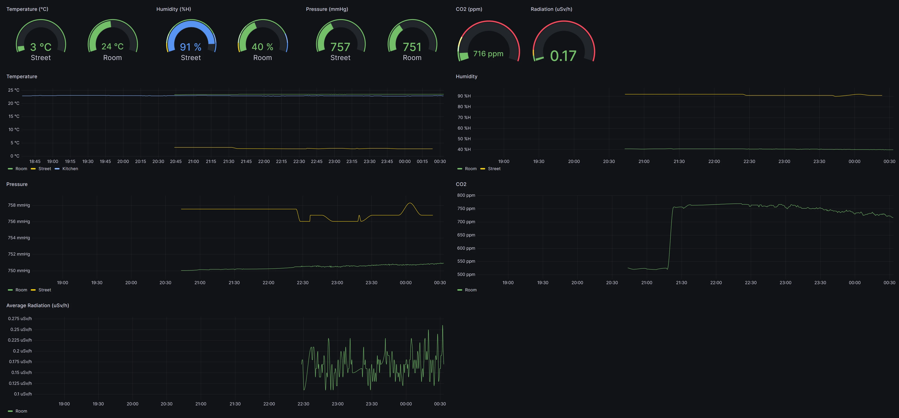

# Bishop

## Handmade self-hosted weather station 
Based on Raspberry Pi Zero 2W

### Supported Sensors and API:
* Nuclear Radiation Detector [FS-5000](https://www.bosean.net/FS-5000-Nuclear-Radiation-Detector.html)
* CO2 Sensor MH-Z19C
* Temperature and Humidity sensor SHT31-D IIC
* Temperature, Humidity & Pressure Sensor BME280
* Weather API [OpenWeatherMap.org](https://openweathermap.org/api)

#### Technology list:
- Java 17
- Gradle
- Lombok
- Slf4j
- Typesafe Config
- quartz
- okHttp3
- JsonPath
- Pi4J
- jSerialComm
- InfluxDb

#### Example of Collected Sensor Data Usage with Grafana Dashboard:

